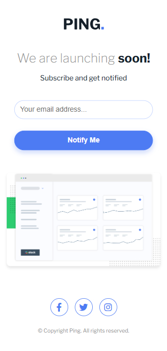

# Frontend Mentor - Ping coming soon page solution

## Welcome! 👋

Thanks for checking out this front-end coding challenge.

This is a solution to the [Ping coming soon page challenge on Frontend Mentor](https://www.frontendmentor.io/challenges/ping-single-column-coming-soon-page-5cadd051fec04111f7b848da). These challenges help you enhance your frontend skills by working on realistic projects.

## Table of Contents

- [Overview](#overview)
  - [The challenge](#the-challenge)
  - [Screens](#screens)
  - [Links](#links)
- [My process](#my-process)
  - [Built with](#built-with)
  - [What I learned](#what-i-learned)

## Overview

### The challenge

Your users should be able to:

- View the optimal layout for the component depending on their device's screen size

- See hover states for all interactive elements on the page

### Screens

#### Desktop Preview

  

#### Mobile Preview

  

### Links

- Solution URL: [GitHub Repository](https://github.com/harisdev-netizen/ping-coming-soon-page)
- Live Site URL: [Ping Coming Soon](https://ping-coming-coon.netlify.app/)
- Figma Design: [Figma Design](https://www.figma.com/design/PzjgUt84EVbGJYO57sV6ej/ping-single-column-coming-soon-page?node-id=0-4550&node-type=frame&t=A1ucBpaEZuFK8Hbe-0)

## My process

### Built with

- Semantic HTML5 markup
- CSS custom properties
- Flexbox
- Responsive design with media queries

### What I learned

1. **Font Setup Using Google Fonts:**
Integrated the `Libre Franklin` font using the `@import` method to establish a professional and clean typography style.
 

2. **Custom CSS Variables:**
Set up reusable color variables in :root, such as `--color-text-primary` and `--color-button-primary`, for a consistent color theme that is easy to manage and update across the project.
 

3. **Flexbox for Layout Structure:**
Flexbox for Centering and Layout: Used Flexbox to structure elements within the `.page`, `.form`, and `.footer__social` classes for responsive centering and alignment.
 

4. **Button Hover Effect:**
Added a hover effect on the submit button, changing the background to transparent and adjusting the text color, creating a visually appealing feedback for user interaction.
 

5. **Responsive Design:**
Ensured responsive styles using media queries, making the layout and font sizes adaptable for mobile, tablet, and desktop views. Adjustments include stacking the form elements vertically on smaller screens for enhanced usability.
 

6. **Social Icons Hover Effect:**
Styled social icons with a hover effect that changes the background color, adding a modern touch and improving user engagement with the footer.
 

**Enjoy building and customizing! 🚀**